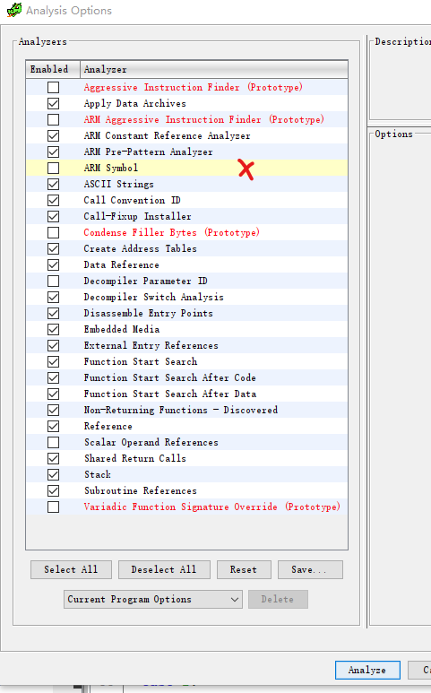

# WL4-ghidra-utils
the repository is used to maintain the WL4 ROM reverse engineering job on Ghidra by xml file, and some helper scripts used in Ghidra.

### How to contribute? 
#### Tools
According to the README file in [NationalSecurityAgency/ghidra](https://github.com/NationalSecurityAgency/ghidra), you need to install JDK, then download and install the Ghidra release file. then launch it.

#### git version control
Clone the repository to your local computer.

***For repository collaborators***: To work with Ghidra. every time you make changes to the repository. The changes should not be on the `main` branch. You always need to create a new branch for the changes. then finish the work in your own branch. then create a Pull Request on Github to request other viewers to review your changes in case conflicts or other problems happen. after we finishing the review, the PR should be squash merged into the `main` branch, so every time there is one commit appear in the `main` branch.

***For other people who want to help***: Join our WL4Editor [discord server](https://discord.gg/EQ6JhvP) and contact ssp (shinespeciall). we are glad to see more people who have some knowledge on GBA ROM reverse engineering join us and help us make the WL4 editor & romhack community better.

#### the xml file
the `WL4.xml` file in the repository is the least things you need. We use this instead of a ghidra server to do version control.
you need to have the correct version of wl4 gba ROM first. it should have the correct hash:
```
SHA1: b9fe05a8080e124b67bce6a623234ee3b518a2c1
MD5: 5fe47355a33e3fabec2a1607af88a404
```
now, rename your ROM file like this: `WL4.bytes` and put it into the same folder with the `WL4.xml`. Don't give the xml or the `bytes` files some other name. or you cannot load the xml into the Ghidra without modification on the xml file manually.

#### open xml in Ghidra
We launch Ghidra first (according to its [readme](https://github.com/NationalSecurityAgency/ghidra)) and you will see the small `Ghidra PROJECT` window. We create a `Non-shared Project` first. It can be created anywhere else in your computer. the `WL4.bytes` and `WL4.xml` should be there too.
after creating a new project in Ghidra, we drag and drop the xml into that `Ghidra PROJECT` window. When the import dialog pop out, we choose a language for it by: `ARM v7 32 LE (little Endian) Visual Studio`. Then hit `OK` to let it process the xml. After everything being finished, we `double click` the `WL4` file in the ListView to launch the `Ghidra Code Browser`.
After opening the `Ghidra Code Browser`. Now you can do the job. **WARNING: When it ask you to perform auto analysis in the `Ghidra Code Browser` by `menu -> Analysis -> Auto Analyze` to reparse the ROM. DON'T select the "ARM Symbol" entry.** It will mess up the address of some global variables and let them all align to even numbers. It happens on my Ghidra v10.1.5. and could happen in newer version too. idk what caused it and have no idea how to fix it. So just be careful anyway.



#### export xml
Once you add some new symbols of info into the project which can help other people understand the WL4 ROM more, you are supposed to share your new finding with exported xml. Save changes first by pressing `Ctrl + S`. Then you can close the `Ghidra Code Browser`. Now we go back to the `Ghidra PROJECT` window which is supposed to be opened all the time. Now we right click on the file in the ListView and click `Export`. In the `Export Dialog` we change the format to `XML`, then hit OK and overwrite the previous `WL4.xml` you cloned from this repository.
Now you can do the git job and commit or PR the changes.

#### Continuous working
If you have already created a WL4 project in Ghidra, you need to delete the file from the ListView in `Ghidra PROJECT` window first, then drag and drop the xml into the project in the `Ghidra PROJECT` window again and redo the import. You need to do this every time you launch the Ghidra, since we only use xml file to do version control. we always need to include the changes made by other people first before continue the work.

#### Reverse Engineering job or other works
Not gonna teach something here. If you are familiar with IDA pro, you can get used to Ghidra quickly. We are supposed to dig deeper into the WL4 ROM or write java & python script to do more crazy stuff in the future.
